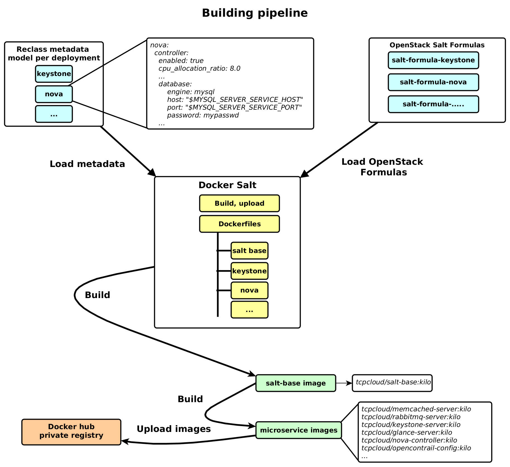

=========================================
Build Docker images of SaltStack formulas
=========================================

Trivial but working way to build docker images using existing SaltStack
formulas.

Quickstart
==========

Install docker, run ``./build.sh`` and see what will happen :-)

Docker Compose
================

It uses host networking, so there must be replaced default ip address by local ip address on the machine.

.. code-block:: bash

    sed -i 's,172.16.1.122,<your ip address>,g' compose/common.env

Then start compose-core.yml, after at least 30 seconds compose-openstack.yml and finally compose-opencontrail.yml

.. code-block:: bash

    docker-compose -f compose-openstack.yml up -d

If you have issues with mysql, set ``SET GLOBAL max_connect_errors=100000;`` in mysql.

Images
======

salt-base
---------

Base image will setup packages repository, install Salt formulas and configure
Salt and Reclass so it's possible for per-service dockerfiles to execute salt
states.

Main idea behind using this base image is that it will ensure that your whole
infrastructure is built from the same version of formulas and metadata.

You can customize most of the things here:

- ``RECLASS_URL``

  - URL to git repository of your reclass structure

- ``RECLASS_BRANCH``
- ``REPO_URL``

  - APT repository with SaltStack formula packages

- ``REPO_COMPONENTS``

Per-formula
-----------

Per-service (aka per-formula) docker files are living in ``services``
directory, see ``services/postfix-server.dockerfile`` as an example.

Entrypoints
===========

There are two supported ways for container post-creation actions (eg. database
and users creation, etc.):

Salt-call entrypoint
--------------------

To reuse what's done in formula and avoid rewriting the code into Bash-based
entrypoint, you can call salt to finalize setup.

- [salt-base] will setup /sbin/service that will workaround absence of upstart
  and other init daemons and simply call script in /etc/init.d if present

  - therefore Salt service states should pass fine and start the services
  - if services are started fine by salt state run, it's possible to execute
    other actions (database creation, etc.)

- [salt-base] will set ``noservices: True`` grain so formulas can recognize
  they are running as a part of image build and will skip all actions that
  require running services

- [<service>-<role>] will generate pillar and it's top file into
  ``/srv/salt/pillar`` and remove reclass

  - so it's possible to run salt with all metadata that container needs but it
    will not have access to other containers' metadata

- [<service>-<role>] will run salt states

  - ``/entrypoint.sh`` is generated by service formula

- [<service>-<role>] remove ``noservices`` grain and do cleanup

- [container creation] when container is created, ``/entrypoint.sh`` is
  executed:

  - replace placeholders by environment variables in
    ``/srv/salt/pillar/<service>-<role>.sls``
  - run salt.highstate to finalize provisioning
  - stop service started by salt run
  - start service on foreground in docker-way, keeping container running

Shell entrypoint
----------------

For services that don't need additional provisioning on container creation or
where having SaltStack present in image is overhead, ``/entrypoint.sh`` can be
simply generated using Jinja on salt run during image creation.

In that case, Salt with it's formulas and Reclass is purged at the end of
image build.

Building pipeline
-----------------

